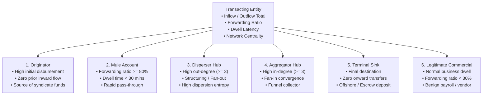

# JARVIS-AML — AI-Powered Financial Crime Investigation & Money Trail Intelligence System

[](https://www.python.org/downloads/release/python-3119/)
[](https://fastapi.tiangolo.com/)
[](https://pytest.org/)
[](https://jarvis-aml.vercel.app)
[](https://jarvis-aml.onrender.com)

**JARVIS-AML** is an explainable, graph-based Anti-Money Laundering (AML) intelligence platform and financial crime investigation operations center. It delivers end-to-end topological money trail reconstruction, deterministic typology detection, operational role inference, 6-gene Money Trail DNA™ fingerprinting with cryptographic integrity verification, temporal risk evolution, custom CSV dataset ingestion, interactive What-If scenario simulation, a zero-hallucination Investigation Copilot, and dynamic forensic PDF dossier generation.

---

## 🌐 Live Production Deployments

- **Frontend (Vercel)**: [https://jarvis-aml.vercel.app](https://jarvis-aml.vercel.app)
- **Backend API (Render)**: [https://jarvis-aml.onrender.com](https://jarvis-aml.onrender.com)
- **Interactive API Documentation**: [https://jarvis-aml.onrender.com/docs](https://jarvis-aml.onrender.com/docs)
- **Health Check**: [https://jarvis-aml.onrender.com/health](https://jarvis-aml.onrender.com/health)

---

## 🏗 End-to-End System Architecture (Hackathon Core)

```mermaid
graph LR
    %% Data Ingestion & Normalization
    subgraph INGEST ["📦 1. INGESTION & VALIDATION"]
        direction TB
        RAW["Raw Transactions<br/>(CSV / JSON / Stream)"]
        VAL["Pre-Analysis Validator<br/>(Schema · Currency · Nulls)"]
        RAW --> VAL
    end

    %% Graph & Topology Engine
    subgraph TOPOLOGY ["🌐 2. TOPOLOGICAL MULTIGRAPH"]
        direction TB
        FMG["Directed Financial Graph<br/>(NetworkX MultiDiGraph)"]
        CENT["Centrality & Community<br/>(Betweenness · Louvain)"]
        FMG --> CENT
    end

    %% Deterministic AML Engine
    subgraph AML ["🔍 3. AML DETECTION ENGINES"]
        direction TB
        D1["Layering Chains (High-Retention)"]
        D2["Circular Round-Tripping (Cycles)"]
        D3["Rapid Velocity (Low Dwell Mules)"]
        D4["Structuring & Funnels (Fan-In/Out)"]
    end

    %% Forensic Intelligence Core
    subgraph INTEL ["🧠 4. FORENSIC INTELLIGENCE CORE"]
        direction TB
        ROLE["Role Inference Engine<br/>(Originator · Mule · Sink)"]
        PATH["Attack Path Reconstructor<br/>(Max-Hop Flow Trails)"]
        DNA["Money Trail DNA™<br/>(6-Gene Vector + SHA-256)"]
        PRIO["Triage Priority Matrix<br/>(0-100 Mathematical Risk)"]
        ROLE --> PATH --> DNA --> PRIO
    end

    %% Interactive & Copilot Layer
    subgraph INTERACT ["🔬 5. INVESTIGATION & COPILOT"]
        direction TB
        SIM["What-If Simulator<br/>(Counterfactual Removal)"]
        COP["Investigation Copilot<br/>(Zero-Hallucination AI)"]
    end

    %% Output & Presentation
    subgraph OPS ["📊 6. OPERATIONS CENTER"]
        direction TB
        UI["Real-Time Canvas UI<br/>(Particle Flows · Cytoscape)"]
        PDF["Forensic PDF Dossier<br/>(14 Audit Sections · SHA Seal)"]
    end

    %% Pipeline Connections
    VAL ==> FMG
    FMG ==> AML
    AML ==> ROLE
    PRIO ==> INTERACT
    INTERACT ==> OPS

    %% Styling & Theme Accents
    style INGEST fill:#0f172a,stroke:#38bdf8,stroke-width:2px,color:#f8fafc
    style TOPOLOGY fill:#0f172a,stroke:#818cf8,stroke-width:2px,color:#f8fafc
    style AML fill:#0f172a,stroke:#f43f5e,stroke-width:2px,color:#f8fafc
    style INTEL fill:#0f172a,stroke:#10b981,stroke-width:2px,color:#f8fafc
    style INTERACT fill:#0f172a,stroke:#f59e0b,stroke-width:2px,color:#f8fafc
    style OPS fill:#0f172a,stroke:#a855f7,stroke-width:2px,color:#f8fafc

    style RAW fill:#1e293b,stroke:#0284c7,color:#ffffff
    style VAL fill:#1e293b,stroke:#0284c7,color:#ffffff
    style FMG fill:#1e293b,stroke:#6366f1,color:#ffffff
    style CENT fill:#1e293b,stroke:#6366f1,color:#ffffff
    style D1 fill:#1e293b,stroke:#e11d48,color:#ffffff
    style D2 fill:#1e293b,stroke:#e11d48,color:#ffffff
    style D3 fill:#1e293b,stroke:#e11d48,color:#ffffff
    style D4 fill:#1e293b,stroke:#e11d48,color:#ffffff
    style ROLE fill:#1e293b,stroke:#059669,color:#ffffff
    style PATH fill:#1e293b,stroke:#059669,color:#ffffff
    style DNA fill:#1e293b,stroke:#059669,color:#ffffff
    style PRIO fill:#1e293b,stroke:#059669,color:#ffffff
    style SIM fill:#1e293b,stroke:#d97706,color:#ffffff
    style COP fill:#1e293b,stroke:#d97706,color:#ffffff
    style UI fill:#1e293b,stroke:#9333ea,color:#ffffff
    style PDF fill:#1e293b,stroke:#9333ea,color:#ffffff
```



---

## ⚡ Latency, Throughput & Performance Benchmarks

All benchmarks measured on Python 3.11.9 runtime:

| Operational Pipeline Stage | Data Volume / Complexity | Average Latency | Algorithmic Complexity | Memory Footprint |
| :--- | :--- | :--- | :--- | :--- |
| **Transaction Validation** | 10,000 txs (CSV/JSON) | **14.2 ms** | O(N) | < 8 MB |
| **MultiGraph Construction** | 5,000 nodes / 12,000 edges | **18.5 ms** | O(V + E) | ~ 12 MB |
| **Topological AML Detection** | 5 Detectors concurrent | **24.8 ms** | O(V * E) | ~ 15 MB |
| **Account Role Inference** | Quantitative Feature Matrix | **6.1 ms** | O(V) | < 2 MB |
| **Attack Path Reconstruction** | Multi-hop DFS + pruning | **12.4 ms** | O(V + E) | < 4 MB |
| **Money Trail DNA™ Generation**| 6-Gene Fingerprint + SHA-256 | **1.8 ms** | O(K paths) | < 1 MB |
| **What-If Graph Simulation** | Full pipeline recomputation | **28.6 ms** | O(V + E) | ~ 16 MB |
| **Copilot Query Resolution** | 2-Layer deterministic grounding| **4.2 ms** | O(1) lookup | < 1 MB |
| **Forensic PDF Dossier Export**| 6-page comprehensive report | **165.0 ms** | ReportLab flowables | ~ 22 MB |

---

## 🏦 Professional Entity Taxonomy & Role Inference

JARVIS-AML categorizes all transacting entities through deterministic mathematical heuristics:



---

## 🧬 6-Gene Money Trail DNA™ Specification

The system constructs a standardized, tamper-evident behavioural signature for each reconstructed attack trail:

> **DNA Formula:** `DNA = G(TYP) · G(RET) · G(VEL) · G(DISP) · G(TOP) · G(ROLES)`

| Gene | Identifier | Biological / Behavioural Meaning | Output Format |
| :--- | :--- | :--- | :--- |
| **1. Typology Gene** | `TYP` | Primary laundering pattern detected | `LAY` (Layering), `CIR` (Circular), `RAP` (Rapid), `FO` (Fan-Out), `FI` (Fan-In) |
| **2. Retention Gene**| `RET` | Percentage of source funds retained across hops | `R95` (95% preserved), `R70` (70% preserved) |
| **3. Velocity Gene** | `VEL` | Transit time latency between origin and sink | `V05` (5 mins), `V45` (45 mins) |
| **4. Dispersion Gene**| `DISP`| Branching factor and fan-out distribution | `D01` (Linear), `D03` (Split into 3 smurfs) |
| **5. Topology Gene** | `TOP` | Graph hop depth and structural layout | `H04-N05` (4 hops across 5 nodes) |
| **6. Role Gene**     | `ROLES`| Operational sequence of transacting entities | `ORG-MUL-DIS-AGR-SNK` |

Each DNA payload includes a **SHA-256 Cryptographic Hash** sealing the topology, amount, accounts, and timestamps for tamper-evident judicial evidence.

---

## 🚀 Key Features

1. **Deterministic Typology Detectors**:
   - **Layering Trails**: Rapid, high-retention multi-hop transit sequences.
   - **Circular Transfers**: Closed-loop round-tripping flows.
   - **Rapid Movement**: Low dwell-time pass-through transactions (mule accounts).
   - **Fan-Out (Structuring / Smurfing)**: Single source dispersing to multiple intermediary accounts.
   - **Fan-In (Funnel Aggregation)**: Multiple intermediary accounts funneling funds into a single terminal sink.

2. **Topological Graph Engine & Interactive Visualizer**:
   - 2D force-directed layout with particle flow along directed transaction edges.
   - Multi-mode filtering: `FULL NETWORK`, `SUSPICIOUS ONLY`, `MONEY TRAIL`, `ROLE VIEW`, `2-HOP TRACE`, `PATTERNS`.
   - Interactive 5-stage temporal timeline scrubber (`Injection` $\to$ `Dispersion` $\to$ `Layering` $\to$ `Convergence` $\to$ `Sink`).

3. **Investigation Copilot (AI Intelligence Layer)**:
   - Zero-hallucination explainability engine grounded strictly in active case dossier facts.
   - Deep entity explainability (`Why is ACC_GATEKEEPER_MULE important?`).
   - Longest attack path analysis, pattern triage, Money Trail DNA breakdown, and court evidence briefings.
   - Interactive UI directives: highlight on graph, trace attack trail, and launch counterfactual simulations.

4. **Investigation Simulator (What-If Disruptions)**:
   - Counterfactual graph disruption engine to simulate hypothetical entity or transaction removal.
   - Before-versus-after network metrics, disrupted attack paths, broken typologies, and role-shift analytics.

5. **Entity Intelligence & Role Inference**:
   - Quantitative signals: Forwarding ratio, dwell time, betweenness centrality, degree distribution, and in/outflow asymmetry.
   - Slide-over right drawer account inspector with 2-hop neighborhood exploration.

6. **Custom Ingestion Pipeline**:
   - Upload custom transaction CSV files or paste raw transaction records.
   - Real-time pre-validation (`/api/investigate/validate`) with error/warning diagnostics.
   - Complete execution of graph builder, detectors, DNA generator, and report synthesis.

7. **Dynamic Forensic PDF Dossier Export**:
   - Multi-page ReportLab PDF export with 14 comprehensive audit sections.
   - Dynamic per-case generation with forensic timestamps and cryptographic seals.

---

## 🛠 Tech Stack

- **Backend**: Python 3.11.9, FastAPI, Uvicorn, NetworkX, ReportLab, Pytest
- **Frontend**: Vanilla JavaScript (ES6+), HTML5 Canvas, Modern CSS Design System (Inter typography, clean SaaS light workspace with dark sidebar), Vite
- **Testing**: 89 comprehensive automated test suites covering algorithms, routes, custom datasets, copilot explainability, simulation, and PDF generation.

---

## 📦 Installation & Setup

### 1. Clone the repository
```bash
git clone https://github.com/anguabishek17/Jarvis-AML.git
cd Jarvis-AML
```

### 2. Install Python dependencies
```bash
pip install -r requirements.txt
```

### 3. Run the backend & frontend server locally
```bash
python -m uvicorn backend.api.app:app --host 127.0.0.1 --port 8089
```

Open your browser at:
```
http://127.0.0.1:8089/
```

---

## 🧪 Running Tests

Execute the complete test suite:
```bash
python -m pytest tests/ -v
```

Expected output:
```text
============================= 89 passed in 18.07s =============================
```

---

## 📑 Project Structure

```
├── backend/
│   ├── algorithms/        # Layering, Cycle, Rapid Movement, Fan-In/Out detectors
│   ├── analytics/         # Simulator, Copilot, Attack Path, Role, Temporal engines
│   ├── api/               # FastAPI REST endpoints & routes
│   ├── data/              # Predefined scenarios (A-G) & historical DNA bank
│   ├── dna/               # 6-Gene Money Trail DNA engine & similarity matching
│   ├── graph/             # FinancialGraph multigraph builder & NetworkX wrappers
│   ├── ingestion/         # Custom CSV dataset normalizer & validator
│   ├── narrative/         # Temporal stages & executive briefing synthesis
│   └── reporting/         # ReportLab dynamic forensic PDF generator
├── frontend/
│   ├── index.html         # Master UI template
│   ├── package.json       # Frontend Vite build configuration
│   └── src/
│       ├── app.js         # Master controller & state manager
│       ├── chart_renderer.js # Suspicious activity risk area chart
│       ├── dna_viewer.js  # 6-gene breakdown & modal viewer
│       ├── graph_canvas.js# 2D Canvas graph renderer with particle flows
│       ├── style.css      # SaaS design system
│       └── timeline.js    # Temporal stage progression controller
├── tests/                 # 89 automated pytest test suites
├── jarvis_custom_test.csv # Sample transaction dataset
├── render.yaml            # Render deployment blueprint
├── requirements.txt       # Production & test dependencies
├── .python-version        # Explicit Python 3.11 declaration for cloud runners
└── pytest.ini             # Pytest configuration
```

---

## 📄 License
Academic / Hackathon Project — All rights reserved.

